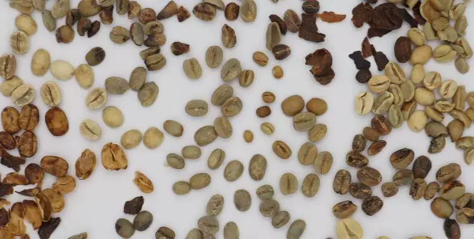
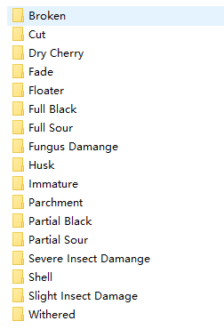
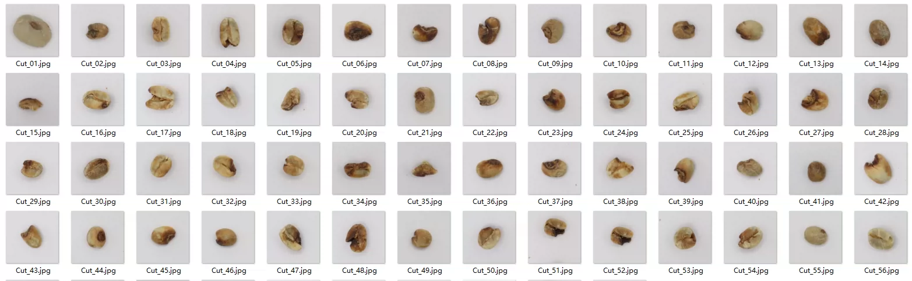
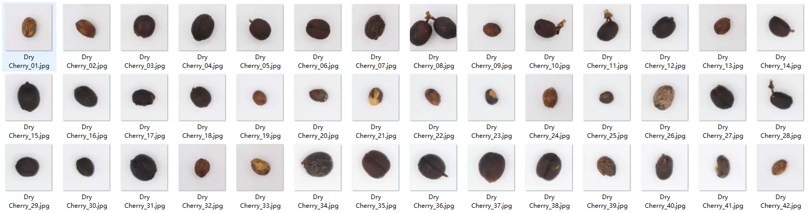
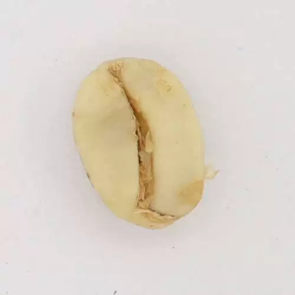

## Body

Coffee Bean Defect Classification Dataset: 17 Types of Defects

This dataset provides the original version (500x500px), covering 17 types of defects found in Arabica green coffee beans.

Totally 979 images, classification dataset with the original paper PDF format.

The defects include: broken, cut, dry cherry, discoloration, floating, full black, full acidity, fungal damage, shell, immature, papery, partial black, partial acidity, severe insect damage, shell, minor insect damage and wilt.

Electronic virtual products are not returnable.

## Images

Here is a pay link on Stripe ( https://buy.stripe.com/3cs8yP7sY87d0vu9AB ). Please contact me lonlonago@foxmail.com after funding $89, and I will send you a complete data files , thank you!

